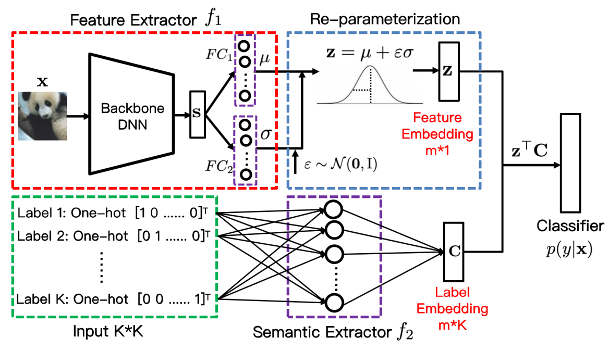

# Adversarially Robust Neural Networks with Feature Uncertainty Learning and Label Embedding (Neural Networks 2024)


This repository is an PyTorch implementation of the Margin-SNN. The paper has been accepted by Neural Networks.

## reqarements
- Ubuntu 16.04.7
- pytorch 1.8.1
- advertorch 0.2.3
- torchattacks 3.4.0
- numpy 1.23.5

## Framework
The framework of Margin-SNN.




## train Margin-SNN
 
``train/le_margin_kl/le_margin_kl_cifar10.py`` -- ( for cifar10).

``train/le_margin_kl/le_margin_kl_cifar10.py --dataset cifar100 --base-dir ../results-cifar100/`` - ( for cifar100).

Margin-SNN can be trained on other datasets in the same way as cifiar100


## Citation
```
@article{Wang2024Adversarially,
  author = "Ran, Wang and Haopeng, Ke and Meng, Hu and Wenhui, Wu",
  title = "Adversarially Robust Neural Networks with Feature Uncertainty Learning and Label Embedding",
  journal = "Neural Networks",
  year = "2024"
}
```


