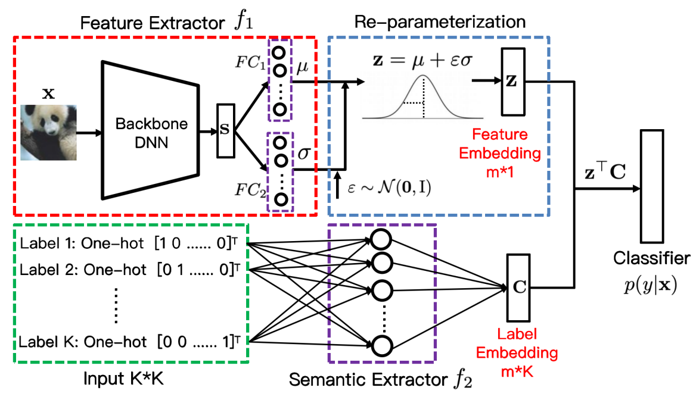

# README.md

# Margin-SNN: Adversarially Robust Neural Networks with Feature Uncertainty Learning and Label Embedding

<div align="center">


</div>


## 📖 Overview

This repository provides the official PyTorch implementation of **Margin-SNN**, proposed in:

> **Ran Wang, Haopeng Ke, Meng Hu, Wenhui Wu**, Adversarially Robust Neural Networks with Feature Uncertainty Learning and Label Embedding, *Neural Networks*, Volume **172**, Article **106087**, April 2024.

Margin-SNN introduces a robust adversarial learning framework that jointly integrates:

- **Feature Uncertainty Learning** for uncertainty-aware robust feature extraction
- **Label Embedding** for semantically enhanced class supervision
- **Margin-based optimization** for improved adversarial discrimination

By combining uncertainty modeling with structured label relationships, Margin-SNN improves clean accuracy and adversarial robustness while preserving semantic consistency.

---

## ✨ Key Features

- 🔒 **Feature Uncertainty Learning**
- 🧠 **Label Embedding for semantic supervision**
- 📏 **Margin-based adversarial optimization**
- 🛡️ Robust against:
  - FGSM
  - PGD
  - CW
  - AutoAttack
- 🚀 Supports CIFAR-10, CIFAR-100, and extensible datasets
- 🌍 PyTorch-based implementation for reproducible research

---

## 🧠 Framework

The overall framework of Margin-SNN:

<p align="center">
  
</p>

### Core Insight

Margin-SNN explicitly models feature uncertainty distributions while embedding semantic label relationships into robust learning, enabling neural networks to maintain stronger resilience under adversarial perturbations.

---

## 🛠️ Requirements

### System Environment

- Ubuntu 16.04.7 / Ubuntu 20.04+
- Python >= 3.9
- PyTorch 1.8.1
- advertorch 0.2.3
- torchattacks 3.4.0
- numpy 1.23.5

### Installation

```bash
conda create -n margin_snn python=3.9
conda activate margin_snn

pip install torch==1.8.1 torchvision
pip install advertorch==0.2.3
pip install torchattacks==3.4.0
pip install numpy==1.23.5
````

---

## 📂 Repository Structure

```bash
Margin-SNN/
│
├── train/
│   └── le_margin_kl/
│       └── le_margin_kl_cifar10.py
│
├── images/
│   └── framework.png
│
├── models/
│   ├── backbone/
│   ├── uncertainty/
│   └── label_embedding/
│
├── utils/
│   ├── attacks/
│   ├── datasets/
│   └── evaluation/
│
├── LICENSE
└── README.md
```

---

## 🚀 Training

### Train on CIFAR-10

```bash
python train/le_margin_kl/le_margin_kl_cifar10.py
```

### Train on CIFAR-100

```bash
python train/le_margin_kl/le_margin_kl_cifar10.py --dataset cifar100 --base-dir ../results-cifar100/
```

### Extend to Other Datasets

Margin-SNN can be trained on other datasets by adapting the CIFAR-100 pipeline:

1. Modify dataset loader in `utils/datasets/`
2. Adjust label embedding configuration
3. Update uncertainty and margin parameters

---

## 📈 Evaluation

Recommended robustness evaluation metrics:

* Natural Accuracy
* FGSM Accuracy
* PGD-20 / PGD-100
* CW Attack
* AutoAttack

---

## 📊 Experimental Results 

| Defense method | Backbone | AT | Clean | PGD |
|----------------|----------|----|-------|-----|
| RSE (2018) (Liu et al., 2018) | ResNext | ✗ | 87.5 | 40.0 |
| DP (2019) (Cohen et al., 2019) | WideResNet-28-10 | ✗ | 87.0 | 25.0 |
| TRADES (2019) (Zhang, Yu, Jiao et al., 2019) | ResNet-18 | ✓ | 84.9 | 56.6 |
| PCL (2019) (Mustafa et al., 2019) | ResNet-110 | ✓ | 91.9 | 46.7 |
| PNI (2019) (He et al., 2019) | ResNet-20 (4x) | ✓ | 87.7 | 49.1 |
| Adv-BNN (2019) (Liu et al., 2019) | VGG-16 | ✓ | 77.2 | 54.6 |
| L2P (2020) (Jeddii et al., 2020) | ResNet-18 | ✓ | 85.3 | 56.3 |
| MART (2020) (Wang et al., 2020) | ResNet-18 | ✓ | 83.0 | 55.5 |
| BPFC (2020) (Addepalli et al., 2020) | ResNet-18 | ✗ | 82.4 | 41.7 |
| RLFLAT (2020) (Song et al., 2020) | WideResNet-32-10 | ✓ | 82.7 | 58.7 |
| MI (2020) (Pang, Xu, & Zhu, 2020) | ResNet-50 | ✗ | 84.2 | 64.5 |
| MMC (2020) (Pang, Xu et al., 2020) | ResNet-32 | ✓ | 81.8 | 56.3 |
| SADS (2020) (Vivek & Venkatesh Babu, 2020) | WideResNet-28-10 | ✗ | 82.0 | 45.6 |
| WCA-Net (2021) (Eustratiadis et al., 2021) | ResNet-18 | ✗ | 93.2 | 71.4 |
| MFDV-SNN (2022) (Yang et al., 2022) | ResNet-18 | ✗ | 93.7 | 79.6 |
| AT-AWP (2020) (Wu et al., 2020) | PreAct ResNet-18 | ✓ | 84.8 | 63.3 |
| MLCAT-wp (2022) (Yu et al., 2022) | PreAct ResNet-18 | ✓ | 85.1 | 66.0 |
| **Margin-SNN (Ours)** | **ResNet-18** | **✗** | **93.7** | **89.8** |

**Note:** ✓ means the model is learned by adversarial training and ✗ means the model is learned by standard training. Data with gray background is cited from the literature (Eustratiadis et al., 2021; Pang, Xu et al., 2020; Yang et al., 2022).

---

## 📝 Citation

If you find this work useful, please cite:

```bibtex
@article{Wang2024MarginSNN,
  author  = {Ran Wang and Haopeng Ke and Meng Hu and Wenhui Wu},
  title   = {Adversarially Robust Neural Networks with Feature Uncertainty Learning and Label Embedding},
  journal = {Neural Networks},
  volume  = {172},
  pages   = {106087},
  year    = {2024}
}
```

## 🤝 Acknowledgements

We sincerely thank:

* PyTorch
* Advertorch
* Torchattacks
* Neural Networks Community
* Adversarial Machine Learning Researchers


